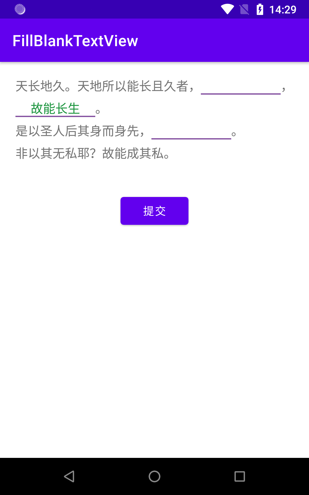

# FillBlankTextView

<br>
<p align="center">

</p>

<br>

<p align="center">
<a href="https://jitpack.io/#Vinx911/FillBlankTextView"></a>


<br>
<br>

FillBlankTextView 基于TextView实现填空文本控件。

> FillBlankTextView仅支持`AndroidX`


- 在XML中，可以使用大多数的TextView的属性
- 在代码中，请使用FillBlankTextView中的textView和editView设置属性样式
- 支持长按复制，xml中添加`android:textIsSelectable`
- 连续4个以上的下划线(\_\_\_\_)表示一个空，下划线越多，空越长


## FillBlankTextView XML属性说明

为防止属性名冲突，添加fbtv前缀

| 属性                            | 值类型    | 默认值 | 说明                                                         |
| :------------------------------ | :-------- | :----- | :----------------------------------------------------------- |
| fbtvBlankTextColor              | color     |        | 扫描区外遮罩的颜色<br/>blankTextColor                        |
| fbtvBlankTextSelectColor        | color     |        | 空文本选中颜色<br/>blankTextSelectColor                      |
| fbtvBlankEllipsize              | enum      | End    | 扫描区边角的颜色<br/>blankEllipsize                          |
| fbtvBlankUnderlineColor         | color     | Black  | 空下划线颜色<br/>blankUnderlineColor                         |
| fbtvBlankUnderlineSelectColor   | color     | Black  | 空下划线选中颜色<br/>blankUnderlineSelectColor               |
| fbtvBlankUnderlineWidth         | dimension | 3f     | 空下划线宽度<br/>blankUnderlineWidth                         |
| fbtvBlankBackground             | drawable  | null   | 空背景<br/>blankBackground                                   |
| fbtvBlankBackgroundOffsetLeft   | dimension | 0      | 空背景左偏移，向外为正，向内为负<br/>blankBackgroundOffsetLeft<br/>setBlankBackgroundOffset() |
| fbtvBlankBackgroundOffsetTop    | dimension | 0      | 空背景上偏移，向外为正，向内为负<br/>blankBackgroundOffsetTop<br/>setBlankBackgroundOffset() |
| fbtvBlankBackgroundOffsetRight  | dimension | 0      | 空背景右偏移，向外为正，向内为负<br/>blankBackgroundOffsetRight<br/>setBlankBackgroundOffset() |
| fbtvBlankBackgroundOffsetBottom | dimension | 0      | 空背景下偏移，向外为正，向内为负<br/>blankBackgroundOffsetBottom<br/>setBlankBackgroundOffset() |


## FillBlankTextView属性说明

Java调用请使用getter/setter

| 属性                        | 值类型       | 默认值         | 说明                                                         |
| :-------------------------- | :----------- | :------------- | :----------------------------------------------------------- |
| text                        | CharSequence |                | 文本                                                         |
| answerList                  | List<String> |                | 答案列表，仅有getter                                         |
| blankTextColor              | Int          | Color.BLACK    | 扫描区外遮罩的颜色                                           |
| blankTextSelectColor        | Int          | Color.BLACK    | 空文本选中颜色                                               |
| blankEllipsize              | TruncateAt   | TruncateAt.END | 扫描区边角的颜色                                             |
| blankUnderlineColor         | Int          | Color.BLACK    | 空下划线颜色                                                 |
| blankUnderlineSelectColor   | Int          | Color.BLACK    | 空下划线选中颜色                                             |
| blankUnderlineWidth         | Float        | 3f             | 空下划线宽度                                                 |
| blankBackground             | drawable     | null           | 空背景                                                       |
| blankBackgroundOffsetLeft   | Int          | 0              | 空背景左偏移，向外为正，向内为负<br/>setBlankBackgroundOffset() |
| blankBackgroundOffsetTop    | Int          | 0              | 空背景上偏移，向外为正，向内为负<br/>setBlankBackgroundOffset() |
| blankBackgroundOffsetRight  | Int          | 0              | 空背景右偏移，向外为正，向内为负<br/>setBlankBackgroundOffset() |
| blankBackgroundOffsetBottom | Int          | 0              | 空背景下偏移，向外为正，向内为负<br/>setBlankBackgroundOffset() |
| inputCompleteDelay          | Long         | 500            | 输入完成延时（毫秒）                                         |
| onAnswerChangedListener     |              | null           | 答案改变监听器                                               |


## FillBlankTextView方法说明
| 方法                                                         | 说明                                                         |
| :----------------------------------------------------------- | :----------------------------------------------------------- |
| `setAnswer(index: Int, answer: String, extra: Any?)`         | 设置答案<br/>index：空索引<br/>answer：答案<br/>extra：答案附加数据 |
| getAnswer(index: Int): String                                | 获取指定位置答案<br/>index：空索引                           |
| getAnswerExtra(index: Int): Any?                             | 获取指定位置答案附加数据<br/>index：空索引                   |
| setSpanChecked(index: Int)                                   | 设置当前选中的空，只改变样式，不显示编辑框，不弹出软键盘<br/>index：空索引 |
| setBlankBackgroundOffset(offset: Int)<br/>setBlankBackgroundOffset(horizontal: Int, vertical: Int)<br/>setBlankBackgroundOffset(left: Int, top: Int, right: Int, bottom: Int) | 设置空背景偏移, 向外为正，向内为负                           |


## 引入

### Gradle:

1. 在Project的 **build.gradle** 里面添加远程仓库  
          
```gradle
allprojects {
		repositories {
			...
			maven { url 'https://jitpack.io' }
		}
	}
```

2. 在Module的 **build.gradle** 里面添加引入依赖项

```gradle
implementation 'com.github.Vinx911:FillBlankTextView:1.0.1'
```

## 示例

布局示例

```Xml
<com.github.vinx911.FillBlankTextView
    android:id="@+id/tv_fill_blank"
    android:layout_width="wrap_content"
    android:layout_height="wrap_content"
    android:lineSpacingExtra="10dp"
    android:text="天长地久。天地所以能长且久者，__________，__________。是以圣人后其身而身先，__________。非以其无私耶？故能成其私。"
    android:textSize="16sp" />
```

代码示例 
```kotlin
fillBlankTextView = findViewById(R.id.tv_fill_blank)
fillBlankTextView.apply {
    this.text = """
                    |天长地久。天地所以能长且久者，__________，__________。
                    |是以圣人后其身而身先，__________。
                    |非以其无私耶？故能成其私。
                """.trimMargin()

    this.setAnswer(1, "故能长生")

    this.blankTextColor = Color.parseColor("#1d953f")
    this.blankTextSelectColor = Color.parseColor("#007947")
    this.blankUnderlineColor = Color.parseColor("#8552a1")
    this.blankUnderlineSelectColor = Color.parseColor("#f173ac")
    this.blankUnderlineWidth = 5f
    this.blankEllipsize = TextUtils.TruncateAt.START
    //        this.blankBackground = getDrawable(R.drawable.bg_blank)
    //        this.setBlankBackgroundOffset(0, 10)
}
```

点击外部取消焦点并隐藏软键盘

```kotlin
override fun dispatchTouchEvent(ev: MotionEvent): Boolean {
        //如果是点击事件，获取点击的view，并判断是否要收起键盘
        if (ev.action == MotionEvent.ACTION_DOWN) {
            //获取目前得到焦点的view
            val view = currentFocus

            if (view != null && isShouldHideKeyboard(view, ev)) {
                fillBlankTextView.setSpanChecked(-1)
            }
        }

        return super.dispatchTouchEvent(ev)
    }

    //判断是否要收起键盘
    private fun isShouldHideKeyboard(view: View, event: MotionEvent): Boolean {
        //如果目前得到焦点的这个view是editText的话进行判断点击的位置
        if (view === fillBlankTextView.editText) {
            val location = intArrayOf(0, 0)
            view.getLocationInWindow(location)
            val left = location[0]
            val top = location[1]
            val bottom = top + view.getHeight()
            val right = left + view.getWidth()
            // 点击EditText的事件，忽略它。
            return (event.x <= left || event.x >= right
                    || event.y <= top || event.y >= bottom)
        }
        return false
    }
```


### 其他

需使用JDK8+编译，在你项目中的build.gradle的android{}中添加配置：

```gradle
compileOptions {
    targetCompatibility JavaVersion.VERSION_1_8
    sourceCompatibility JavaVersion.VERSION_1_8
}

```

更多使用详情，请查看[app](app)中的源码使用示例

## 混淆

无需混淆规则


## 版本记录

#### v1.0.0：2022-7-14
* 参考[TMLAndroid/FillBlankDemo](https://github.com/TMLAndroid/FillBlankDemo)实现

#### v1.0.1：2022-7-14

* 移除属性名下划线
* 添加Readme
* 修改默认颜色为黑色
* 修改默认下划线宽